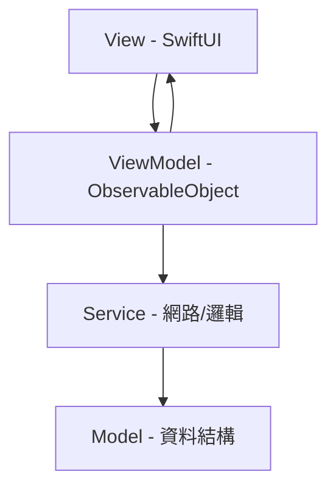
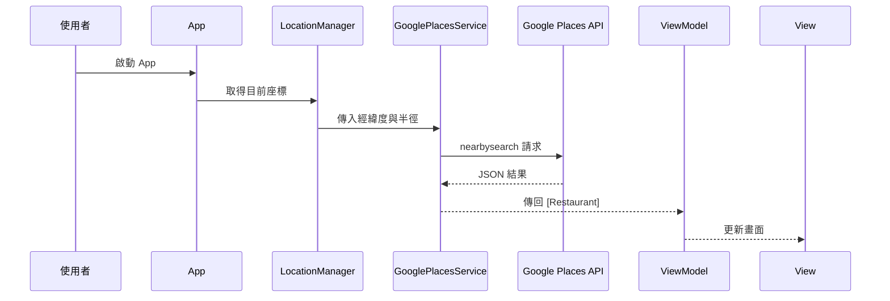

# 午餐要吃什麼 iOS App 開發規劃文件 (plan_iOS.md)

## 一、專案簡介

**名稱**：午餐要吃什麼 (LunchApp)  
**平台**：iOS (SwiftUI + MVVM)  
**目標版本**：iOS 16 以上  
**開發語言**：Swift 5.9  
**主要功能**：透過 Google Maps Places API，根據使用者定位自動推薦附近餐廳，可依族群偏好調整推薦結果。

---

## 二、專案架構 (MVVM + Service Layer)



### 分層說明
- **View**：呈現資料、綁定狀態
- **ViewModel**：處理商業邏輯與狀態更新
- **Service**：封裝 API 呼叫與地理定位邏輯
- **Model**：定義資料結構與解析對應

---

## 三、檔案與資料夾結構

```
LunchApp/
 ├─ LunchAppApp.swift            // App 入口
 ├─ Models/                      // 資料模型層
 │   ├─ Restaurant.swift         // 餐廳資料模型
 │   ├─ PlacesResponse.swift     // API 回傳結構
 │   └─ UserPreference.swift     // 使用者偏好設定
 ├─ ViewModels/                  // 狀態邏輯層
 │   ├─ RestaurantViewModel.swift
 │   ├─ DetailViewModel.swift
 │   └─ SettingsViewModel.swift
 ├─ Views/                       // 畫面組件
 │   ├─ RestaurantListView.swift
 │   ├─ RestaurantDetailView.swift
 │   ├─ FilterSheetView.swift
 │   ├─ SettingsView.swift
 │   └─ MapView.swift
 ├─ Services/                    // 系統服務層
 │   ├─ GooglePlacesService.swift
 │   ├─ LocationManager.swift
 │   └─ ImageLoader.swift
 ├─ Utilities/                   // 公用工具
 │   ├─ Constants.swift
 │   └─ Extensions.swift
 ├─ Resources/
 │   ├─ Assets.xcassets
 │   └─ Info.plist
 └─ Preview Content/
```

---

## 四、主要技術元件

| 功能 | 技術 | 說明 |
|------|------|------|
| UI 架構 | SwiftUI | 組件式畫面與 Preview 開發 |
| 狀態管理 | ObservableObject / @StateObject | 維持資料同步 |
| API 整合 | URLSession (async/await) | 呼叫 Google Places API |
| JSON 解析 | Codable | 簡化資料對應 |
| 定位功能 | CoreLocation | 取得使用者座標 |
| 快取圖片 | URLCache / AsyncImage | 加速餐廳圖片載入 |
| 儲存資料 | AppStorage / CoreData | 收藏與歷史紀錄 |

---

## 五、主要模組設計

### 1️⃣ 餐廳推薦模組
- 透過 Google Places API `nearbysearch` 取得周邊餐廳清單
- 以距離、評分、價格、偏好等因子計算加權排序
- 支援 radius (500m ~ 3000m) 篩選

### 2️⃣ 偏好設定模組
| 族群 | 偏好 | 範圍 | 價格 | 額外篩選 |
|------|------|------|------|-----------|
| 學生 | 平價近距離 | 0.5km | $ | 快餐類 |
| 上班族 | 快速外帶 | 1km | $$ | 商業午餐 |
| 素食者 | 純素/蛋奶素 | 2km | $$ | vegetarian_restaurant |

### 3️⃣ 詳情模組
- 顯示餐廳名稱、評價、地址、距離、Google 照片與評論
- 支援導航（開啟 Google Maps / Apple Maps）
- 收藏與分享功能

### 4️⃣ 地理定位模組
- 使用 `CLLocationManager` 取得使用者目前位置
- 首次啟動請求定位權限 (`NSLocationWhenInUseUsageDescription`)
- 若拒絕權限，顯示「手動輸入地點」選項

---

## 六、API 呼叫流程



### Google Places API 範例
```
https://maps.googleapis.com/maps/api/place/nearbysearch/json?location=LAT,LNG&radius=1000&type=restaurant&key=YOUR_API_KEY
```

---

## 七、UI 預覽流程

1️⃣ **啟動畫面**：定位權限詢問  
2️⃣ **主頁**：餐廳清單顯示 + 篩選按鈕  
3️⃣ **詳情頁**：顯示詳細資料、圖片與地圖  
4️⃣ **設定頁**：選擇族群與調整偏好  

---

## 八、開發時程 (預估)

| 階段 | 任務 | 時長 |
|------|------|------|
| M1 | App 架構 & UI Scaffold | 1 週 |
| M2 | CoreLocation + API 串接 | 2 週 |
| M3 | 餐廳清單與詳情頁 | 2 週 |
| M4 | 偏好與設定模組 | 1 週 |
| M5 | 收藏與歷史 | 1 週 |
| M6 | 測試與上架 | 1 週 |

---

## 九、設計原則
- SwiftUI 結構化與模組化
- Combine/async 並行安全
- 使用 MVVM 隔離邏輯與畫面
- 地理定位與 API 錯誤需完整提示
- 介面遵循 iOS Human Interface Guidelines

---

**作者**：Lex Chien  
**版本**：v1.0.0  
**更新日期**：2025-10-31
